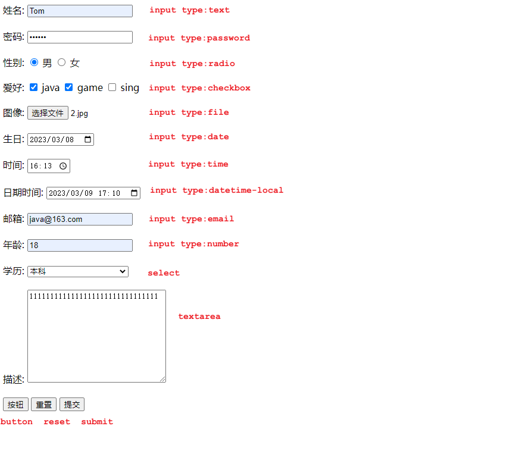
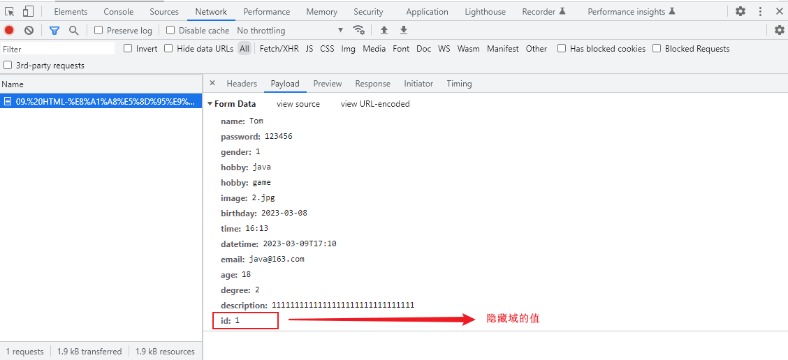

- [1. 标签](#1-标签)
  - [1.1. 没有语义的布局标签](#11-没有语义的布局标签)
  - [1.2. 图片标签 img](#12-图片标签-img)
  - [1.3. 标题标签 h 系列](#13-标题标签-h-系列)
  - [1.4. 超链接](#14-超链接)
  - [1.5. 视频、音频标签](#15-视频音频标签)
  - [1.6. 段落标签](#16-段落标签)
  - [1.7. 文本格式标签](#17-文本格式标签)
  - [1.8. 水平分页线标签 hr](#18-水平分页线标签-hr)
  - [1.9. 表格标签](#19-表格标签)
  - [1.10. 表单标签](#110-表单标签)

---

```html
<html>
	<head>
    	<title> </title>
    </head>
    <body>
       
    </body>
</html>
```
```html
<!-- 文档类型为HTML -->
<!DOCTYPE html>
<html lang="en">
<head>
    <!-- 字符集为UTF-8 -->
    <meta charset="UTF-8">
    <!-- 设置浏览器兼容性 -->
    <meta http-equiv="X-UA-Compatible" content="IE=edge">
    <!-- 显示比例 -->
    <meta name="viewport" content="width=device-width, initial-scale=1.0">
</head>
<body>
</body>
</html>
```
# 1. 标签
HTML中的标签特点:
- HTML标签不区分大小写
- HTML标签的属性值，采用单引号、双引号都可以

## 1.1. 没有语义的布局标签
- 特点：

  - div标签：

    - 一行只显示一个（独占一行）

    - 宽度默认是父元素的宽度，高度默认由内容撑开

    - 可以设置宽高（width、height）

  - span标签：

    - 一行可以显示多个

    - 宽度和高度默认由内容撑开

    - 不可以设置宽高（width、height）


## 1.2. 图片标签 img

```html
A. 图片标签: 

B. 常见属性: 
	src: 指定图像的url (可以指定 绝对路径 , 也可以指定 相对路径)
	width: 图像的宽度 (像素 / 百分比 , 相对于父元素的百分比)
	height: 图像的高度 (像素 / 百分比 , 相对于父元素的百分比)
	
	备注: 一般width 和 height 我们只会指定一个，另外一个会自动的等比例缩放。
	
C. 路径书写方式:
    绝对路径:
        1. 绝对磁盘路径: C:\Users\Administrator\Desktop\HTML\img\news_logo.png
        			   

        2. 绝对网络路径: https://i2.sinaimg.cn/dy/deco/2012/0613/yocc20120613img01/news_logo.png
        			   
    
    相对路径:
        ./ : 当前目录 , ./ 可以省略的
        ../: 上一级目录
```


## 1.3. 标题标签 h 系列

```html
A. 标题标签: <h1> - <h6>
    
	<h1>111111111111</h1>
	<h2>111111111111</h2>
	<h3>111111111111</h3>
	<h4>111111111111</h4>
	<h5>111111111111</h5>
	<h6>111111111111</h6>
	
B. 效果 : h1为一级标题，字体也是最大的 ； h6为六级标题，字体是最小的。
```
## 1.4. 超链接

- 标签: &lt;a href="..." target="...">央视网</a>
- 属性:
  - href: 指定资源访问的url
  - target: 指定在何处打开资源链接
    - _self: 默认值，在当前页面打开
    - _blank: 在空白页面打开

## 1.5. 视频、音频标签

- 视频标签: &lt;video>
  - 属性: 
    - src: 规定视频的url
    - controls: 显示播放控件
    - width: 播放器的宽度
    - height: 播放器的高度

- 音频标签: &lt;audio>
  - 属性:
    - src: 规定音频的url
    - controls: 显示播放控件

## 1.6. 段落标签
- 换行标签: &lt;br>
  - 注意: 在HTML页面中,我们在编辑器中通过回车实现的换行, 仅仅在文本编辑器中会看到换行效果, 浏览器是不会解析的, HTML中换行需要通过br标签

- 段落标签: &lt;p>
  - 如: &lt;p> 这是一个段落 &lt;/p>
##  1.7. 文本格式标签

| 效果   | 标签 | 标签(强调) |
| ------ | ---- | ---------- |
| 加粗   | b    | strong     |
| 倾斜   | i    | em         |
| 下划线 | u    | ins        |
| 删除线 | s    | del        |

前面的标签 b、i、u、s 就仅仅是实现加粗、倾斜、下划线、删除线的效果，是没有强调语义的。 而后面的strong、em、ins、del在实现加粗、倾斜、下划线、删除线的效果的同时，还带有强调语义。

## 1.8. 水平分页线标签 hr

## 1.9. 表格标签


- &lt;table> : 用于定义整个表格, 可以包裹多个 &lt;tr>， 常用属性如下： 
  - border：规定表格边框的宽度
  - width：规定表格的宽度
  - cellspacing: 规定单元之间的空间

- &lt;tr> : 表格的行，可以包裹多个 &lt;td>  
- &lt;td> : 表格单元格(普通)，可以包裹内容 , 如果是表头单元格，可以替换为 &lt;th>  (具有加粗居中展示的效果)

```html
<table border="1px" cellspacing="0"  width="600px">
    <tr>
        <th>序号</th>
        <th>品牌Logo</th>
        <th>品牌名称</th>
        <th>企业名称</th>
    </tr>
    <tr>
        <td>1</td>
        <td>  </td>
        <td>华为</td>
        <td>华为技术有限公司</td>
    </tr>
    <tr>
        <td>2</td>
        <td>  </td>
        <td>阿里</td>
        <td>阿里巴巴集团控股有限公司</td>
    </tr>
</table>
```
## 1.10. 表单标签

- 表单场景: 表单就是在网页中负责数据采集功能的，如：注册、登录的表单。 

- 表单标签: &lt;form>
- 表单属性:
  - action: 规定表单提交时，向何处发送表单数据，表单提交的URL。
  - method: 规定用于发送表单数据的方式，常见为： GET、POST。
    - GET：表单数据是拼接在url后面的， 如： xxxxxxxxxxx?username=Tom&age=12，url中能携带的表单数据大小是有限制的。
    - POST： 表单数据是在请求体（消息体）中携带的，大小没有限制。

- 表单项标签: 不同类型的input元素、下拉列表、文本域等。
  - &lt;input>: 表单项 , 通过type属性控制输入形式。

    | type取值                 | **描述**                             |
    | ------------------------ | ------------------------------------ |
    | text                     | 默认值，定义单行的输入字段           |
    | password                 | 定义密码字段                         |
    | radio                    | 定义单选按钮                         |
    | checkbox                 | 定义复选框                           |
    | file                     | 定义文件上传按钮                     |
    | date/time/datetime-local | 定义日期/时间/日期时间               |
    | number                   | 定义数字输入框                       |
    | email                    | 定义邮件输入框                       |
    | hidden                   | 定义隐藏域                           |
    | submit / reset / button  | 定义提交按钮 / 重置按钮 / 可点击按钮 |

  - &lt;select>: 定义下拉列表, &lt;option> 定义列表项

  - &lt;textarea>: 文本域

```html
<form action="" method="post">
     姓名: <input type="text" name="name"> <br><br>
     密码: <input type="password" name="password"> <br><br> 
     性别: <input type="radio" name="gender" value="1"> 男
          <label><input type="radio" name="gender" value="2"> 女 </label> <br><br>
     爱好: <label><input type="checkbox" name="hobby" value="java"> java </label>
          <label><input type="checkbox" name="hobby" value="game"> game </label>
          <label><input type="checkbox" name="hobby" value="sing"> sing </label> <br><br>
     图像: <input type="file" name="image">  <br><br>
     生日: <input type="date" name="birthday"> <br><br>
     时间: <input type="time" name="time"> <br><br>
     日期时间: <input type="datetime-local" name="datetime"> <br><br>
     邮箱: <input type="email" name="email"> <br><br>
     年龄: <input type="number" name="age"> <br><br>
     学历: <select name="degree">
               <option value="">----------- 请选择 -----------</option>
               <option value="1">大专</option>
               <option value="2">本科</option>
               <option value="3">硕士</option>
               <option value="4">博士</option>
          </select>  <br><br>
     描述: <textarea name="description" cols="30" rows="10"></textarea>  <br><br>
     <input type="hidden" name="id" value="1">
	 	
     <!-- 表单常见按钮 -->
     <input type="button" value="按钮">
     <input type="reset" value="重置"> 
     <input type="submit" value="提交">   
     <br>
</form>
```




```html
<input type="text" placeholder="Default Content">
```
> 注意事项
>
> 表单中的所有表单项，要想能够正常的采集数据，在提交的时候能提交到服务端，表单项必须指定> name属性。 否则，无法提交该表单项。
> 
> ```html
> 用户名: <input type="text" name="username">
> ```
