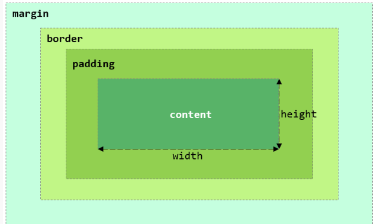
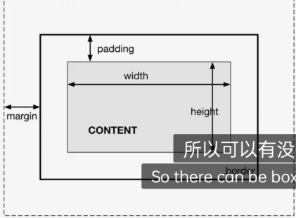
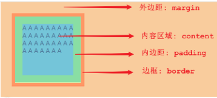

- [1. 盒子模型](#1-盒子模型)
- [2. CSS选择器](#2-css选择器)
- [3. 常用](#3-常用)
---
## 1. 盒子模型


  



- 盒子模型组成：内容区域（content）、内边距区域（padding）、边框区域（border）、外边距区域（margin）
- 盒子的大小，其实就包括三个部分： border、padding、content，而margin外边距是不包括在盒子之内的。

```
#center {
    width: 65%;
    /* margin: 0% 17.5% 0% 17.5% ; */ /* 外边距, 上 右 下 左 */
    margin: 0 auto;
}
```

## 2. CSS选择器
元素选择器 `tagname`，id选择器 `#id`，class选择器`.classname`

```css
 div{
     color: red;
 }
 #did {
    color: blue;
}
.cls{
     color: green;
 }
```

## 3. 常用
- `color`
- `background-color`
- text-indent: 设置段落的首行缩进 
- line-height: 设置行高
- text-align: 设置对齐方式, 可取值为 left / center / right


> 注意事项: 
>
> - 在HTML页面中无论输入了多少个空格, 最多只会显示一个。 可以使用空格占位符（&nbsp；）来生成空格，如果需要多个空格，就使用多次占位符。
>
> - 那在HTML中，除了空格占位符以外，还有一些其他的占位符(了解, 只需要知道空格的占位符写法即可)，如下：
>
>   - | 显示结果 | 描述   | 占位符  |
>     | :------- | :----- | :------ |
>     |          | 空格   | \&nbsp; |
>     | <        | 小于号 | \&lt;   |
>     | >        | 大于号 | \&gt;   |
>     | &        | 和号   | \&amp;  |
>     | "        | 引号   | \&quot; |
>     | '        | 撇号   | \&apos; |
