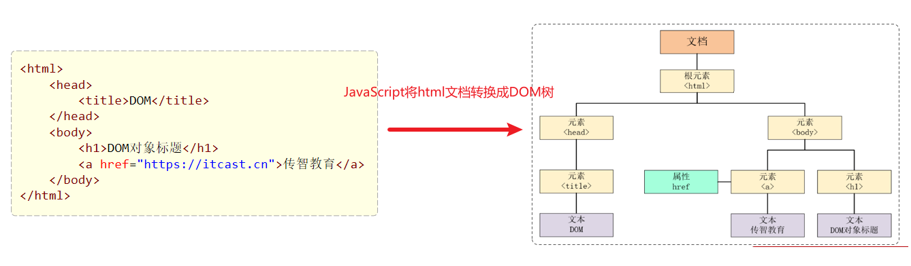

DOM：Document Object Model 文档对象模型。也就是 JavaScript 将 HTML 文档的各个组成部分封装为对象。

HTML 文档分为
- Document：整个文档对象
- Element：元素对象
- Attribute：属性对象
- Text：文本对象
- Comment：注释对象



## 获取DOM对象

| 函数                              | 描述                                     |
| --------------------------------- | ---------------------------------------- |
| document.getElementById()         | 根据id属性值获取，返回单个Element对象    |
| document.getElementsByTagName()   | 根据标签名称获取，返回Element对象数组    |
| document.getElementsByName()      | 根据name属性值获取，返回Element对象数组  |
| document.getElementsByClassName() | 根据class属性值获取，返回Element对象数组 |

```html
<!DOCTYPE html>
<html lang="en">
  <head>
    <meta charset="UTF-8">
    <meta name="viewport" content="width=device-width, initial-scale=1.0">
    <link rel="stylesheet" href="src/style.css">
  </head>
  <body>
    <h1 id="header"></h1>
    <div name='hello'></div>
    <div name='hello'></div>
    
    <div class='aclass'></div>
    <div class='aclass'></div>

    <script src="src/script.js"></script>
  </body>
</html>
```
```js
var header = document.getElementById('header');
console.log(header);  // <h1 id="header"></h1>

var names = document.getElementsByName('hello');
console.log(names[0]);  // <div name="hello"></div>

var names = document.getElementsByTagName('div');
console.log(names[0]);  // <div name="hello"></div>

var names = document.getElementsByClassName('aclass');
console.log(names[0]);  // <div class="aclass"></div>
```

querySelector: 同css一样 `#id`, `tagname`, `.classname`
```js
// querySelector
var header = document.querySelector('#header');
console.log(header);  // <h1 id="header"></h1>

// querySelectorAll
var names = document.querySelectorAll('div');
console.log(names[0]);  // <div name="hello"></div>

var names = document.querySelectorAll('.aclass');
console.log(names[0]);  // <div name="hello"></div>
```

## 

### 1.6.2 事件绑定 

JavaScript对于事件的绑定提供了2种方式：

- 方式1：通过html标签中的事件属性进行绑定


    ~~~html
    <input type="button" id="btn1" value="事件绑定1" onclick="on()">
    <script>
        function on(){
            alert("按钮1被点击了...");
        }
    </script>
    ~~~

- 方式2：通过DOM中Element元素的事件属性进行绑定

    ~~~js
    document.getElementById('btn2').onclick = function(){
        alert("按钮2被点击了...");
    }
    ~~~


| 事件属性名  | 说明                     |
| ----------- | ------------------------ |
| onclick     | 鼠标单击事件             |
| onblur      | 元素失去焦点             |
| onfocus     | 元素获得焦点             |
| onload      | 某个页面或图像被完成加载 |
| onsubmit    | 当表单提交时触发该事件   |
| onmouseover | 鼠标被移到某元素之上     |
| onmouseout  | 鼠标从某元素移开         |