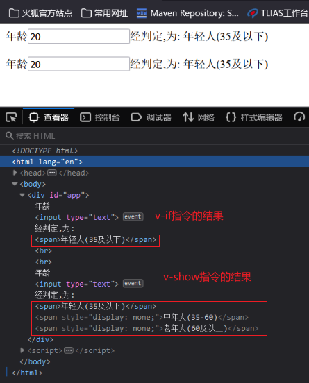
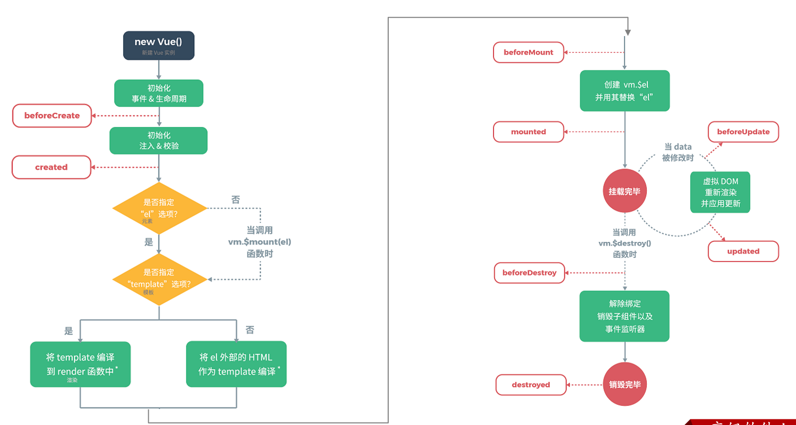

## 1. 导入Vue

1. 在线导入

    ```js
    <script src="https://cdn.jsdelivr.net/npm/vue/dist/vue.js"></script>
    ```
2. 离线导入

    ```js
    <script src="vue.js"></script>
    ```
## 2. Vue指令

| **指令**  | **作用**                                            |
| --------- | --------------------------------------------------- |
| v-bind    | 为HTML标签绑定属性值，如设置  href , css样式等      |
| v-model   | 在表单元素上创建双向数据绑定，绑定到value属性上|
| v-on      | 为HTML标签绑定事件                                  |
| v-if/v-else-if/v-else| 条件性的渲染某元素，判定为true时渲染,否则不渲染     |
| v-show    | 根据条件展示某元素，区别在于切换的是display属性的值 |
| v-for     | 列表渲染，遍历容器的元素或者对象的属性              |



[vue.html](./demo/vue.html)

## 3. 生命周期

vue的生命周期：指的是vue对象从创建到销毁的过程。

vue的生命周期包含8个阶段：每触发一个生命周期事件，会自动执行一个生命周期方法，这些生命周期方法也被称为钩子方法。

| 状态          | 阶段周期 |
| ------------- | -------- |
| beforeCreate  | 创建前   |
| created       | 创建后   |
| beforeMount   | 挂载前   |
| **mounted**       | 挂载完成 |
| beforeUpdate  | 更新前   |
| updated       | 更新后   |
| beforeDestroy | 销毁前   |
| destroyed     | 销毁后   |




mounted：挂载完成，Vue初始化成功，HTML页面渲染成功。**以后我们一般用于页面初始化自动的ajax请求后台数据**

~~~html
<script>
    //定义Vue对象
    new Vue({
        el: "#app", //vue接管区域
        data:{
           
        },
        methods: {
            
        },
        mounted () {
            alert("vue挂载完成,发送请求到服务端")
        }
    })
</script>
~~~
